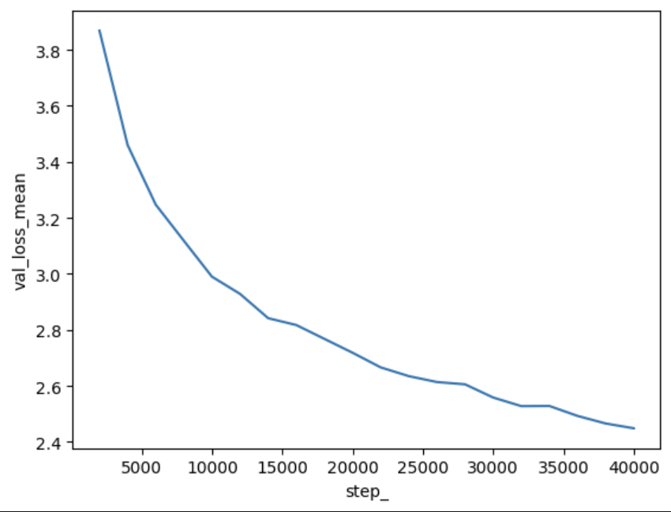
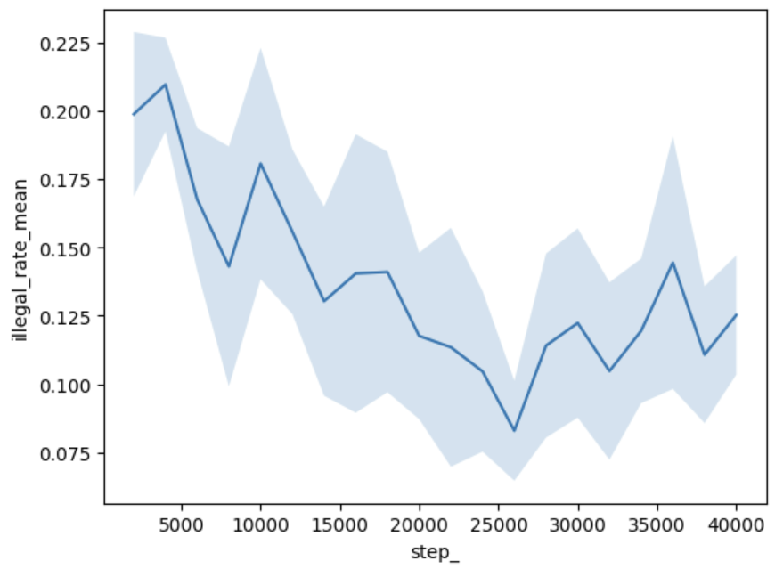

# C-GPT: A Transformer Chess Engine

A decoder-only transformer trained on millions of chess games to predict next moves through autoregressive sequence modeling. The model learns to play chess purely from move sequences in standard algebraic notation (SAN), with no explicit knowledge of chess rules or board state.

## Results

The model was trained on ~10M high-ELO (2100+) games from the [angeluriot/chess_games](https://huggingface.co/datasets/angeluriot/chess_games) HuggingFace dataset using an NVIDIA T4 GPU on GCP.

**Loss curve:**



The model converged to a cross-entropy loss of ~2.4 after approximately 40,000 training steps.

**Illegal move rate:**



The illegal move rate decreased from ~20% to ~8% over training, meaning the model learns to generate legal chess moves ~92% of the time purely from sequence prediction, with no explicit chess rules encoded.

## Architecture

The model follows the GPT architecture from Vaswani et al. (2017) and Karpathy's nanoGPT implementation:

- Decoder-only transformer with causal masking
- Token embedding + learned positional embedding
- Multi-head self-attention with scaled dot-product attention
- Feed-forward layers with ReLU activation and 4x expansion
- Pre-norm layer normalization with residual connections
- Move-level tokenization in standard algebraic notation

**Knight model (primary):**

| Parameter | Value |
|-----------|-------|
| Embedding dim | 256 |
| Attention heads | 8 |
| Layers | 8 |
| Context window | 180 moves |
| Vocab size | ~5,000 |
| Total parameters | ~15M |

## Project Structure

```
c-gpt/
├── config.py                  # Hyperparameters and model configurations
├── src/
│   ├── data/
│   │   └── preprocess.py      # Data pipeline: HuggingFace -> tokenized tensors
│   └── models/
│       ├── model_base.py      # GPT model architecture
│       ├── train.py           # Training loop with checkpointing and evaluation
│       └── test.py            # Stockfish evaluation framework
├── data/
│   ├── raw/                   # Source datasets
│   └── processed/             # Tokenized tensors and vocab mappings
├── models/                    # Saved checkpoints and evaluation results
├── notebooks/                 # Development and analysis notebooks
└── misc/
    └── san_strings/           # Chess move vocabulary
```

## Setup

```bash
python3 -m venv venv
source venv/bin/activate
pip install torch torchvision --index-url https://download.pytorch.org/whl/cu121
pip install numpy pandas datasets chess stockfish python-chess
```

Stockfish is required for evaluation:
```bash
# Linux
sudo apt-get install stockfish

# Windows: download from https://stockfishchess.org/download/
```

## Usage

**Preprocess data:**
```bash
python -m src.data.preprocess
```
Streams games from HuggingFace, filters by ELO, tokenizes moves, and saves tensors to `data/processed/`.

**Train:**
```bash
python -m src.models.train
```
Configure training parameters and model architecture in `config.py`. Supports checkpoint recovery for interrupted training runs.

**Evaluate:**
```bash
python -m src.models.test
```
Plays games against Stockfish at configurable skill levels, tracking illegal move rate, win/loss, and game length.

## How It Works

The model treats chess games as sequences of move tokens and learns to predict the next move given the preceding moves. During training, the causal mask ensures each position can only attend to previous moves, mirroring the autoregressive generation process.

At inference, the model generates a move and checks legality. If the move is illegal, it falls back to masking illegal moves from the probability distribution and resampling.

The model implicitly learns piece movement rules, opening theory, and basic positional patterns through next-token prediction alone, without any explicit chess knowledge.

## Limitations

- No explicit board state representation forces the model to reconstruct position from move history
- Tactical depth is limited at 15M parameters
- The model plays at a beginner level, understanding piece movement and openings but lacking strategic depth

## Future Work (v2)

- Board state encoding as auxiliary input to provide spatial awareness
- Logit masking during training to ensure every gradient update learns from legal moves only
- Larger model (124M parameters) with multi-GPU training
- Dockerized training pipeline with GCS artifact storage

## Acknowledgments

- Architecture based on [Karpathy's nanoGPT](https://github.com/karpathy/nanoGPT) and the ["Let's build GPT from scratch"](https://www.youtube.com/watch?v=kCc8FmEb1nY) video
- Training data from the [angeluriot/chess_games](https://huggingface.co/datasets/angeluriot/chess_games) dataset
- Evaluation powered by [Stockfish](https://stockfishchess.org/)